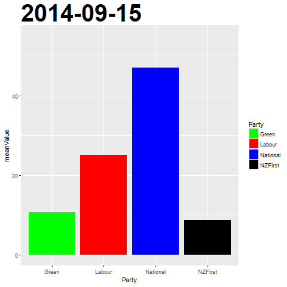

  
```{r setup, include=FALSE}
library(tidyverse)
library(lubridate)
library(flexdashboard)

poll <- read.table(file="polls.csv",header=T,sep=",")


### make the plot data to long table first
pollplot <- poll  %>%   mutate(GL=Labour + Green, Date=ymd(paste(Year, Month, 15,sep = '-'))) %>% select(-Order,-Year,-Month) %>% select(Poll,Date, everything())%>%   gather(.,Date, Poll,  3:NCOL(.) )
colnames(pollplot) <- c("Poll","Date","Party","Value")


```


Poll Day
===================================================
  
### Without winston 
  
```{r, fig.width=10}
# GL + N + W
a <- pollplot %>% filter(Party %in% c("National","Green","Labour","NZFirst")) %>% ggplot(.,aes(x=Date,y=Value,colour=Party)) + 
  geom_point(position = position_jitter(width=5, height=0.0),aes(shape=Poll,size=1.5),alpha=0.7) +
  scale_shape_manual(values=c(18,17,15, 16, 1)) +
  stat_smooth(formula = y ~ poly(x,5), method="glm", level = 0.99,size=1,aes(weight=Date)) + 
  scale_y_continuous(name="Percent of the Vote",breaks=seq(0,60,5)) +
  scale_color_manual(values=c("green","red","blue", "black")) +
  theme(axis.text.x = element_text(angle = 45, hjust = 0.6)) +
  labs( x = "Polling Date",title ="Going to The Polls",
        subtitle = "Guessing the Election",
        caption = "Who does Winston 1st Choose") + 
  theme(plot.subtitle = element_text(size = 15), plot.caption = element_text(size = 15), 
        axis.title = element_text(size = 15), plot.title = element_text(size = 20))
a 
```

-----------------------------------------------
  
### with winston
  
```{r, fig.width=10}


## with winston
pollplot %>% filter(Party %in% c('National',"GL")) %>% left_join(., pollplot %>% filter(Party == "NZFirst"), by = c('Poll',"Date")) %>% mutate(Party = paste0(Party.x,"_" ,Party.y), Value = Value.x + Value.y) %>%  ggplot(data=. ,aes(x=Date,y=Value,colour=Party)) + 
  geom_hline(aes(yintercept=50), colour="black", linetype="dashed",size=1.5)+
  stat_smooth(formula = y ~ poly(x,5), method="glm", size=1,aes(weight=Date),level = 0.99) + 
  geom_point(position = position_jitter(width=5, height=0.0),aes(shape=Poll,size=1.5),alpha=0.7) +
  scale_shape_manual(values=c(18,17,15, 16, 1)) +
  scale_y_continuous(name="Percent of the Vote",breaks=seq(0,60,5)) +
  scale_color_manual(values=c("brown","blue")) +
theme(axis.text.x = element_text(angle = 45, hjust = 0.6)) +
  labs( x = "Polling Date",title ="Going to The Polls",
        subtitle = "With Winston") + 
  theme(plot.subtitle = element_text(size = 15), plot.caption = element_text(size = 15), 
        axis.title = element_text(size = 15), plot.title = element_text(size = 20))


```


All Parties {data-orientation=rows}
==================================================
  
  Row {data-height=600}
-------------------------------------
  
### Major parties
  
```{r, fig.width = 10}


a <- pollplot %>% filter(Party %in% c("National","Green","Labour","NZFirst")) %>% group_by(Date,Party) %>% summarise(meanValue = mean(Value, na.rm=TRUE)) %>% ggplot(.,aes(x=Date,y=meanValue,colour=Party)) + 
  geom_line(alpha=0.7,size=1.5) +
  scale_shape_manual(values=c(18,17,15, 16, 1)) +
  #stat_smooth(formula = y ~ poly(x,5), method="glm", level = 0.99,size=1,aes(weight=Date)) + 
  scale_y_continuous(name="Mean Poll Percent of the Vote",breaks=seq(0,60,5)) +
  scale_color_manual(values=c("green","red","blue", "black")) +
  theme(axis.text.x = element_text(angle = 45, hjust = 0.6)) +
  labs( x = "Polling Date",title ="Major Parties") + 
  theme(plot.subtitle = element_text(size = 15), plot.caption = element_text(size = 15), 
        axis.title = element_text(size = 15), plot.title = element_text(size = 20)) + geom_hline(yintercept = 50) + theme_bw()
a 
```

### Bar

```{r, include = FALSE}
library(animation)

for (date in unique(pollplot$Date) ) {
  p<- pollplot %>% filter(Party %in% c("National","Green","Labour","NZFirst")) %>% filter(Date == date) %>% group_by(Party) %>% summarise(meanValue = mean(Value, na.rm=TRUE)) %>% ggplot(.,aes(x = Party, y=meanValue,fill=Party)) + geom_bar( stat = "identity") + scale_fill_manual(values=c("green","red","blue", "black")) + ylim(c(0,55)) + ggtitle(as_date(date))
  plot(p)
  ani.record() # record the current frame
}

oopts = ani.options(interval = 1.0)
saveGIF(expr = ani.replay(), movie.name = "record_plot.gif" )

```




Row {data-height=600}
-------------------------------------
  
### Minor parties
  
```{r, fig.width=10}
a <- pollplot %>% filter(!Party %in% c("National","Green","Labour","NZFirst","GL")) %>% group_by(Date,Party) %>% summarise(meanValue = mean(Value, na.rm=TRUE)) %>% ggplot(.,aes(x=Date,y=meanValue,colour=Party)) +
  geom_line(alpha=0.7,size=1.5) +
  scale_shape_manual(values=c(18,17,15, 16, 1)) +
  scale_y_continuous(name="Mean Poll Percent of the Vote",breaks=seq(0,60,5)) +
  scale_color_manual(values=c("yellow","lightblue","blue", "black","red","purple")) +
  theme(axis.text.x = element_text(angle = 45, hjust = 0.6)) +
  labs( x = "Polling Date",title ="Minor Parties") + 
  theme(plot.subtitle = element_text(size = 15), plot.caption = element_text(size = 15), 
        axis.title = element_text(size = 15), plot.title = element_text(size = 20)) + theme_bw()
a 
```

